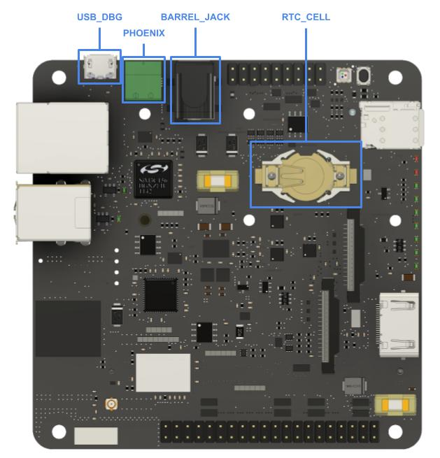
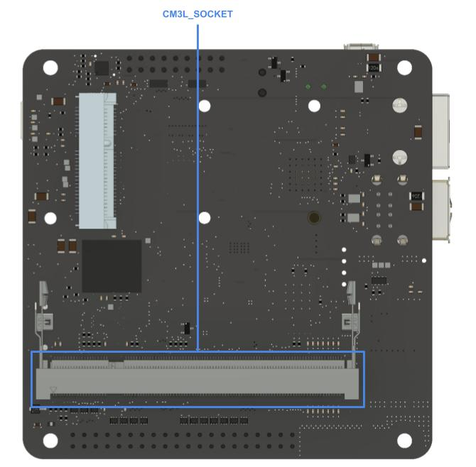
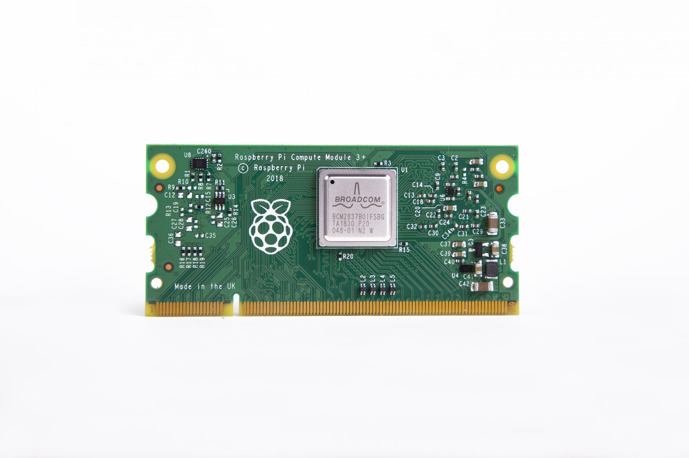
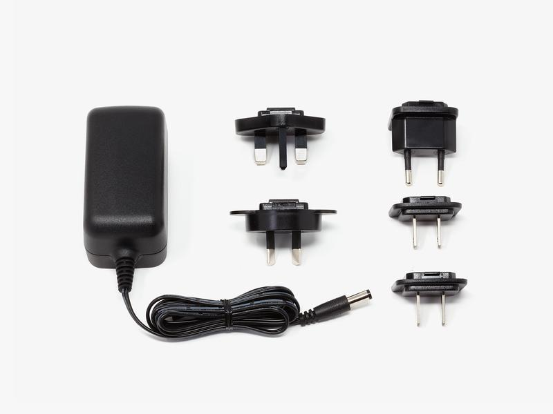

# Getting Started

## What you will need

The best way to get started is with the balenaFin [Developer Kit](https://store.balena.io/collections/developer-kit), wich contains all the components you will need for this tutorial.

### v1.0 BalenaFin

Any balenaFin storage variant (8GB, 16GB, 32GB and 64GB) will work for this tutorial. If you don’t have a Developer Kit, you can order a standalone balenaFin from [our Store](https://store.balena.io/collections/frontpage).

| Top Side                                                   |
| :--------------------------------------------------------: |
|  |

| Bottom Side                                                      |
| :--------------------------------------------------------------: |
|  |

### Micro-USB to USB cable

To flash your Fin with an OS, you will need to connect it to your computer with a USB to Micro-USB cable. If you are not using the cable provided with the Developer Kit, it is important to use a high-quality cable to avoid connection issues.

### Raspberry Pi Compute Module 3 (or 3+) Lite

The balenaFin **only supports the Lite version** of the Raspberry Pi Compute Module 3 and 3+ (CM3L/CM3+L). “Lite” means that this version of the compute module doesn't have an onboard eMMC. This is very important since the non-lite version (CM3/CM3+) has a fixed eMMC which would conflict with the onboard eMMC on the balenaFin.

### Power Supply

The balenaFin Developer kit includes a 5.5/2.1mm Barrel Jack Power supply that can be connected to the Barrel connector on the Fin (see BARREL_JACK on Top Mapping).
Any other compatible power supply can also be connected with a Phoenix connector (see PHOENIX on Top Mapping). The negative polarity of the Phoenix connector is labeled on the PCB with a “-” symbol. If using a different power supply from the one included in the Developer Kit, please make sure it can provide 6-24V and at least 12.5W.
You can also power the balenaFin from the 5V pins exposed by the HAT connector, 2.5A are required as per the HAT specification.

## Hardware set-up

### Raspberry Pi Compute Module

Place the SODIMM-200 Raspberry Pi Compute Module in the dedicated socket on the rear of the board (see CM3L/CM3+L socket on Bottom Mapping). Make sure the two side clips are gripping the module on its dedicated semicircular holes.

### RTC coin-cell battery

Place the coin-cell battery in its socket (see RTC_CELL on Top Mapping) with the positive polarity side facing upwards.
This step can be skipped if you don’t have a coin-cell available. Keep in mind that any RTC examples will not work properly.

## Installing an Operating System (OS)

### Selecting an OS

There are two operating systems officialy supported _(1)_ for the balenaFin, [balenaOS](https://balena.io/docs/reference/OS/overview/2.x/) and [Raspbian](https://www.raspberrypi.org/documentation/raspbian/) _(2)_. Pre-configured versions of both OS for the balenaFin can be found in the [downloads section](https://www.balena.io/fin/1.0/docs/downloads/). Once you downloaded the image of the selected OS, jump into the next section for flashing instructions.

_(1): Apart from the officially supported OS, any OS that works on the Raspberry Pi 3 B+ should work on the balenaFin if properly configured_
_(2): If downloading a non pre-configured version of Raspbian, make sure you add the balenaFin [config files](https://github.com/balena-io/balena-fin)_

### Flashing the OS

This tutorial will asume you are using [balenaEtcher](/etcher) _(1)_ for flashing the OS. You can use any other tool of your choice, please refer to the [official Raspberry Pi documentation](https://www.raspberrypi.org/documentation/hardware/computemodule/cm-emmc-flashing.md) for more information. The following procedure will show you how to put the balenaFin into USB Mass Storage Mode (necessary to flash the OS) and how to flash the selected OS image.

- Before powering on the Fin, connect a **USB to Micro-USB** cable between your system and the Fin's **USB_DBG** port.
- Now, connect power to the Fin, either using the **Phoenix** or **Barrel** connector (Do not connect power to both!).
- Open [balenaEtcher](/etcher) _(2)_ and select the OS image you downloaded on the previous section. _(2)_
- You should see your balenaFin listed as a **Compute Module** under the "Select drive" menu. _(3)_
- Once selected, two red (5V and 3V3) and one green (ACT) LEDs should be illuminated on the balenaFin LED status panel _(3)_
- The balenaFin is now ready to be flashed with an OS.

_(1): Make sure that you are running the latest version of balenaEtcher. v1.5 or above is required for flashing the CM3+L_
_(2): If you are using a Linux platform, make sure you are running balenaEtcher using `sudo`._
_(3): Please refer to the [troubleshooting section](https://www.balena.io/fin/1.0/docs/troubleshooting/) if this step is unsuccessful_

### Booting the OS

After successfully flashing the OS to the balenaFin, remove the microUSB cable from the **PRG** port and then power it on by either using the **Phoenix** or **Barrel** connector (Do not connect power to both!). The Fin should now boot normally into the newly flashed OS.

## Using the balenaFin with balenaOS

### Getting started with balenaOS

The best way to get started is to connect the Fin to your wireless network and deploy a sample container. If you are not sure how to do that, head over to the balenaOS [documentation](https://balena.io/os/docs/fincm3/getting-started/) on the balenaFin for a complete guide.

### Sample projects

Now that you are familiar with loading application containers, let's try using the modules available on the balenaFin. We put together a [repository](https://github.com/balena-io/balena-fin-examples) to get you started with some examples.

