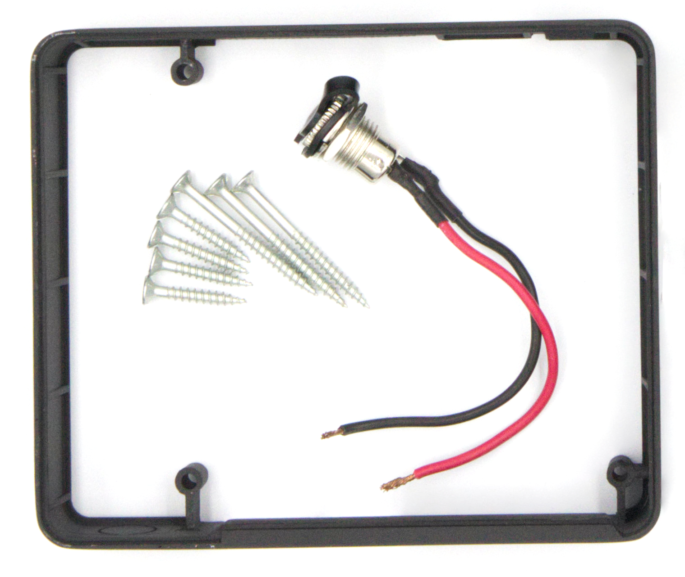
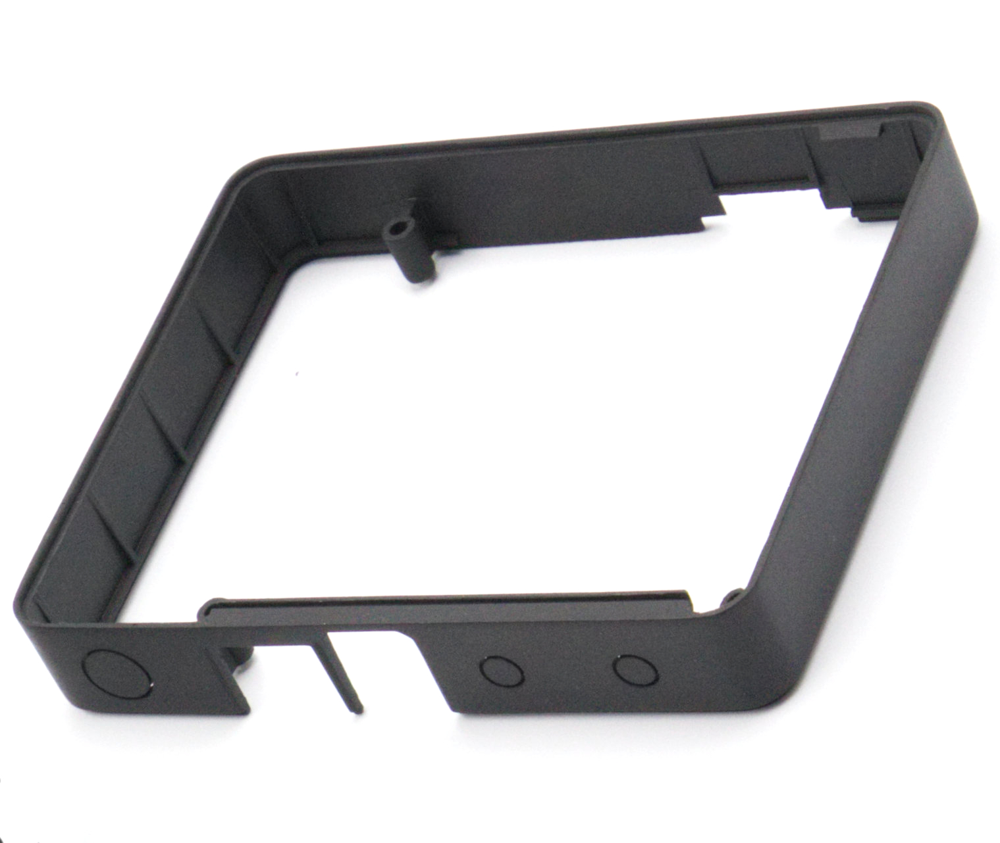
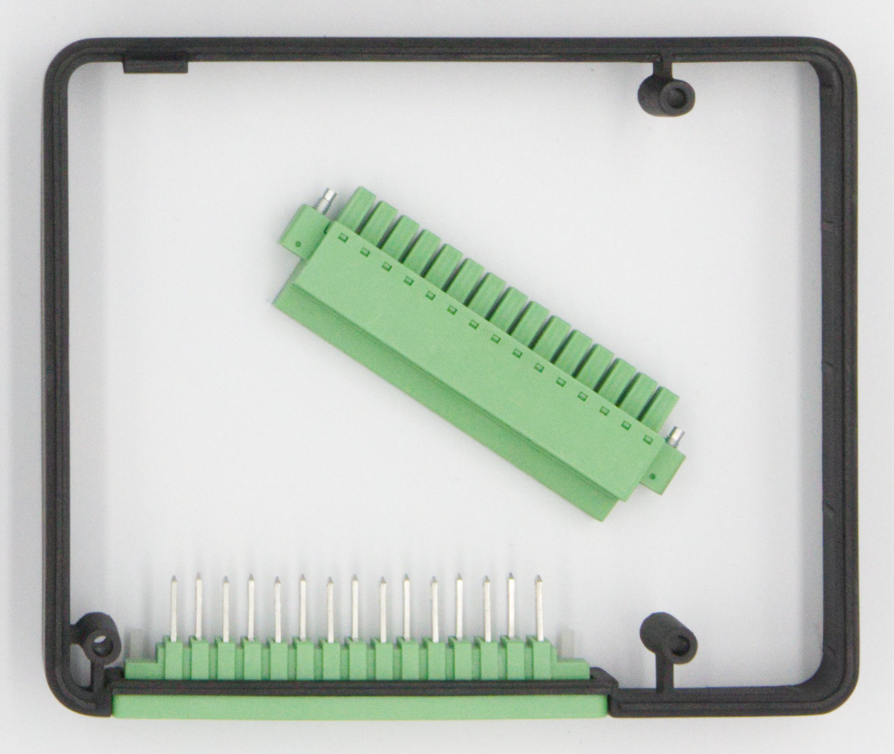
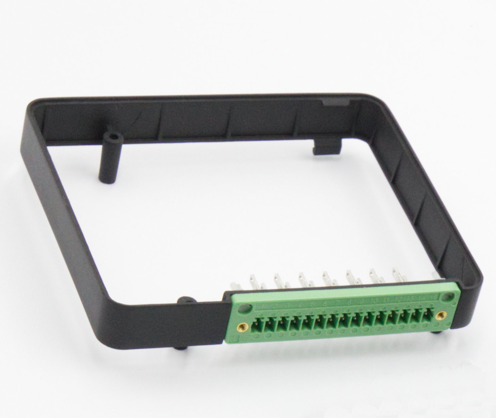
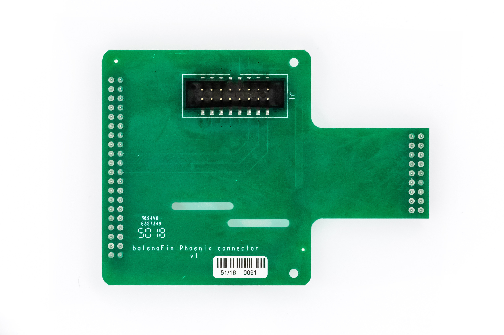
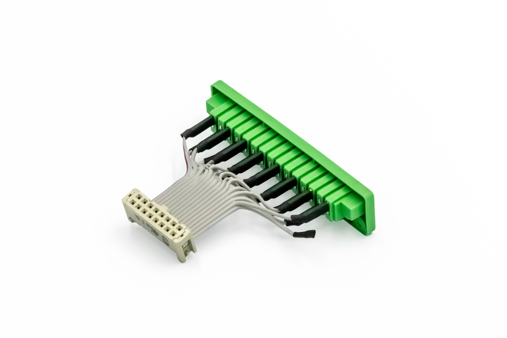

| **Document Type** | Datasheet |
| --- | --- |
| **Product ID:** | FIN00028 (v2) |
| **Product Name** | Modular DIN-rail Case |
| **Document Version** | 1.0.0 |
| **Author** | Nicolas Tzovanis |
| **State (Draft/Proposed/Approved)** | Approved |

## Revision history

| **Date (dd/mm/yyyy)** | **Version** | **Author** | **Description** |
| --- | --- | --- | --- |
| 24/05/2018 | 0.0.1 | Nicolas Tzovanis | First release |
| 06/07/2019 | 0.0.2 | Nicolas Tzovanis | Update phoenix ring pinout |
| 11/07/2019 | 1.0.0 | Nicolas Tzovanis | Fix balenaFin HAT pinout |

# 1. Introduction

The modular DIN-rail case is the official protective enclosure for the balenaFin. It is compatible with all v1 balenaFins (v1.x.x). The modular ring design allows standard or custom HATs to be included inside the case.  

## 1.1 Standard balenaFin ring

| Top | Front |
| :--------------------------------------------------------: | :--------------------------------------------------------------: |
|  |  |

Standard ring for balenaFin, exposes the following ports:

- USB port
- RJ45 ethernet port
- Barrel jack (5.5 x 2.1mm) input power
- Removable cap for WiFi external antenna
- Removable cap for Bluetooth external antenna

## 1.2 Terminal block ring

| Top | Bottom |
| :--------------------------------------------------------: | :--------------------------------------------------------------: |
|  |  |
| HAT | IDC cable |
|  |  |

The terminal block ring extends balenaFin I/O headers to the exterior of the case. Comes with a HAT and IDC cable.  

### 1.2.1 Terminal block ring pin map

| **Fin header pin #** | **Co-processor header pin #** | **Case terminal pin #** | **Pin name** |
| --- | --- | --- | --- |
| 2  | NC | 1  | 5V             |
| 19 | NC | 2  | BCM10 (MOSI)   |
| 6  | NC | 3  | GND            |
| 21 | NC | 4  | BCM9 (MISO)    |
| 8  | NC | 5  | BCM14 (TXD)    |
| 23 | NC | 6  | BCM11 (SCLK)   |
| 10 | NC | 7  | BCM15 (RXD)    |
| NC | 1  | 8  | PD14           |
| 3  | NC | 9  | BCM2 (SDA)     |
| NC | 3  | 10 | PA2            |
| 5  | NC | 11 | BCM3 (SCL)     |
| NC | 5  | 12 | PA3            |
| 12 | NC | 13 | BCM18 (PWM0)   |
| NC | 13 | 14 | PF6            |
| 16 | NC | 15 | BCM23          |

# 2 Mechanical dimensions

All units are in **mm**

| Top | Bottom |
| :--------------------------------------------------------: | :--------------------------------------------------------------: |
|  |  |

| Back | Front |
| :--------------------------------------------------------: | :--------------------------------------------------------------: |
|  |  |

| Right | Left |
| :--------------------------------------------------------: | :--------------------------------------------------------------: |
|  |  |

| Back ports | Front ports|
| :--------------------------------------------------------: | :--------------------------------------------------------------: |
|  |  |
