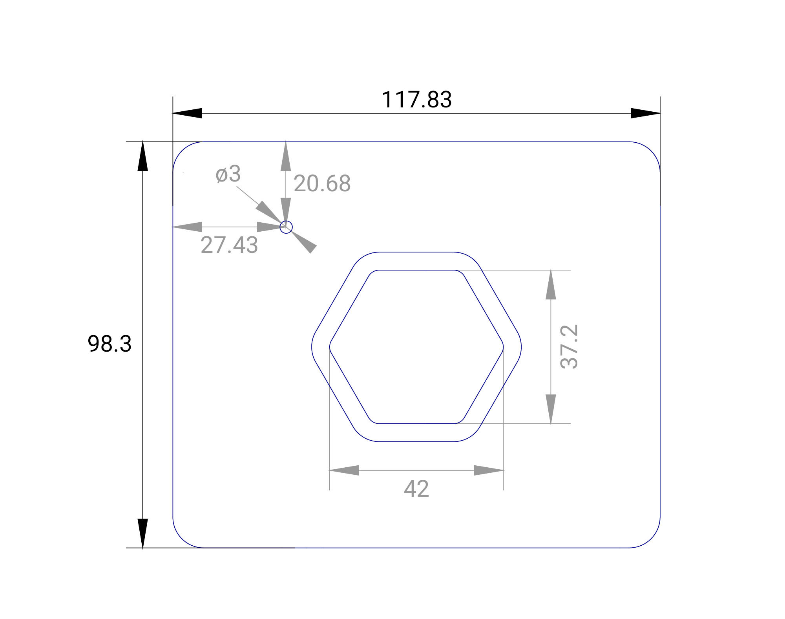
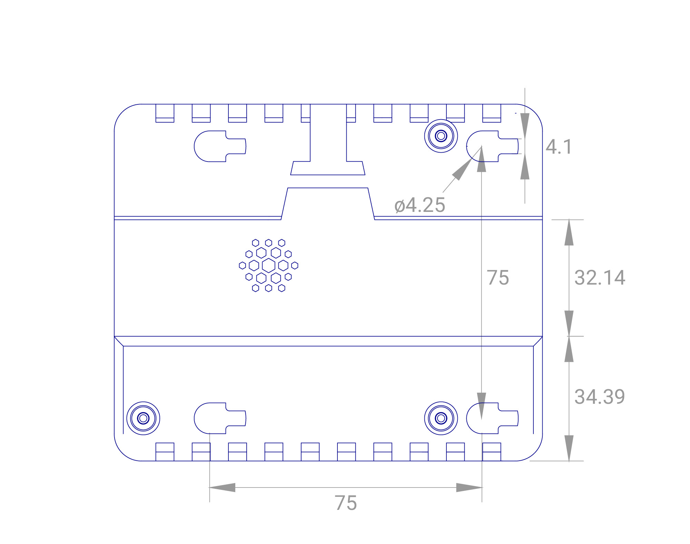
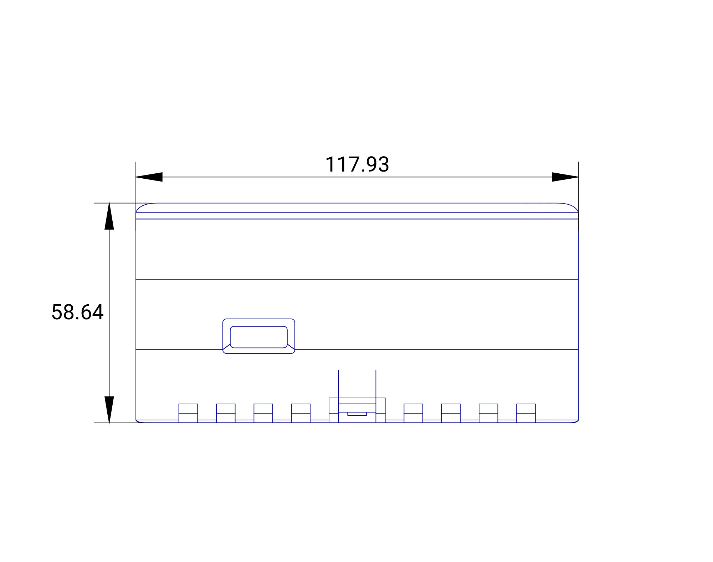
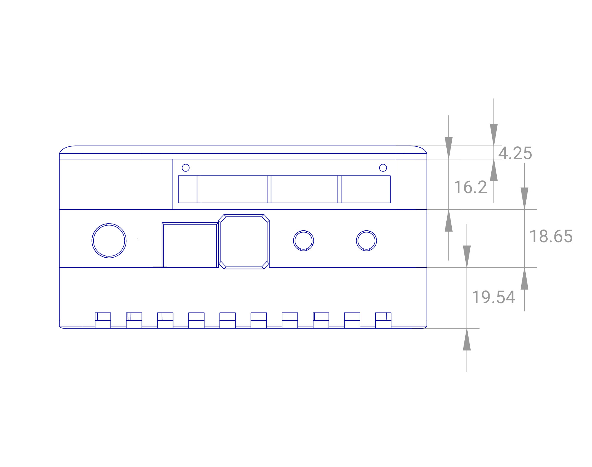
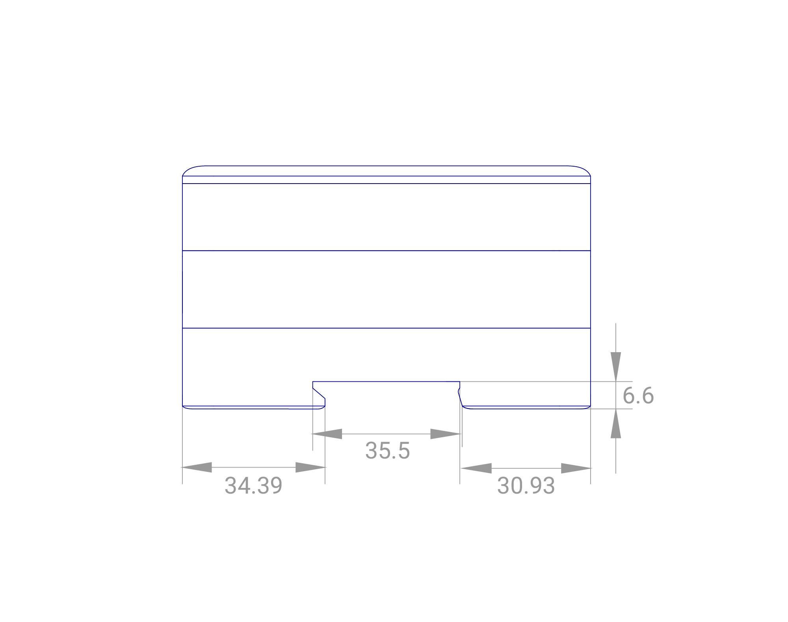
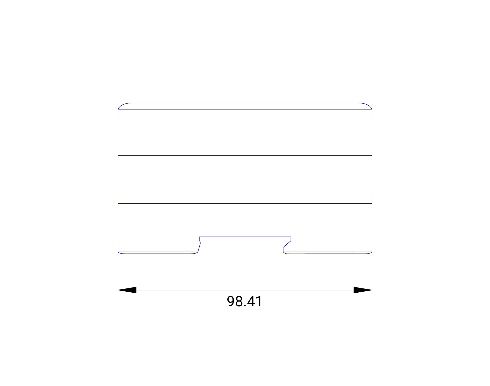
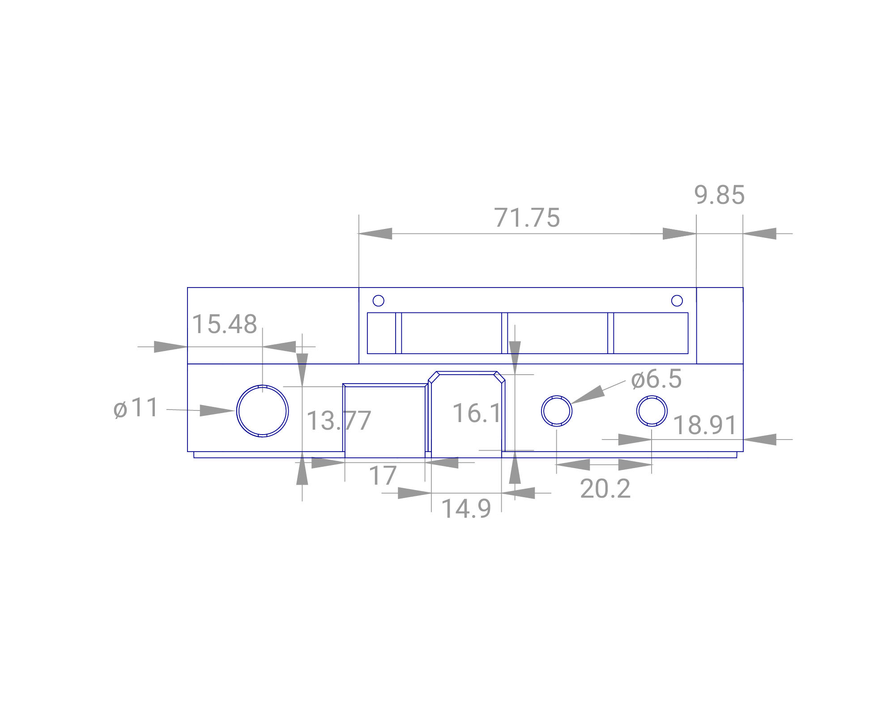

| **Document Type** | Datasheet |
| --- | --- |
| **Product ID:** | FIN00028 (v2) |
| **Product Name** | Modular DIN-rail Case |
| **Document Version** | 0.0.1 |
| **Author** | Nicolas Tzovanis |
| **State (Draft/Proposed/Approved)** | Draft |

## Revision history

| **Date (dd/mm/yyyy)** | **Version** | **Author** | **Description** |
| --- | --- | --- | --- |
| 24/05/2018 | 0.0.1 | Nicolas Tzovanis | First release |

## Case dimensions

All units are in **mm**

| Top | Bottom |
| :--------------------------------------------------------: | :--------------------------------------------------------------: |
|  |  |

| Back | Front |
| :--------------------------------------------------------: | :--------------------------------------------------------------: |
|  |  |

| Right | Left |
| :--------------------------------------------------------: | :--------------------------------------------------------------: |
|  |  |

| Back ports | Front ports|
| :--------------------------------------------------------: | :--------------------------------------------------------------: |
|  |  |